# アドイン作成の基本手順

このページでは ArcGIS Pro アドインを作成するための最も基本的なステップを紹介します。

```
言語: C#
ArcGIS Pro: 1.1
Visual Studio: 2013, 2015
```

**ステップ 1**

Visual Studio を起動し [ファイル] → [新規作成] → [プロジェクト] を選択します。

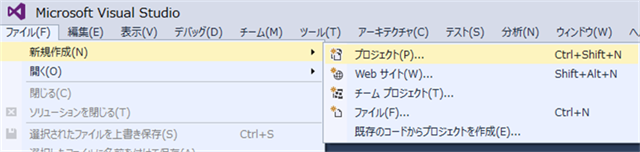

**ステップ 2**

[新しいプロジェクト] ダイアログで [テンプレート] → [Visual C#] → [ArcGIS] と展開し [ArcGIS Pro Add-ins] フォルダーを選択します（ArcObjects SDK for .NET などをご使用の環境にインストールしている場合、ArcGIS フォルダには [ArcGIS Pro Add-ins] フォルダー以外のフォルダーが存在している場合があります）。

**ステップ 3**

ArcGIS Pro モジュール アドイン テンプレートを選択しプロジェクト名に ProAppModule と入力します。必要に応じてプロジェクトの保存場所を変更してください。[OK] をクリックします。

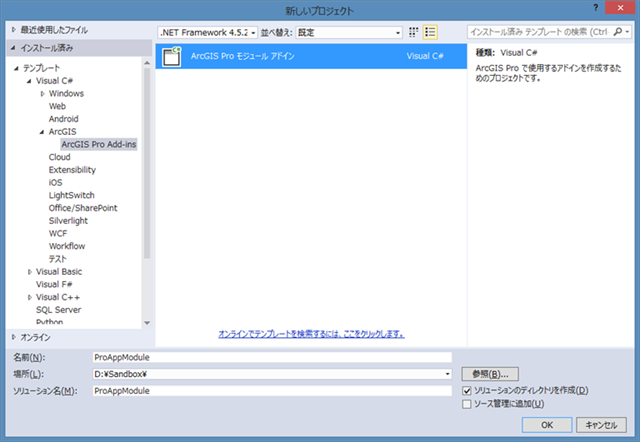

**ステップ 4**

Visual Studio によって新規プロジェクトが作成されます。

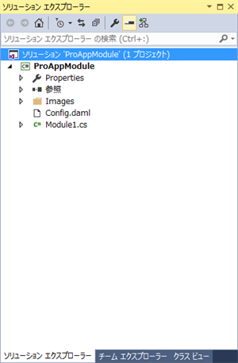


既定の設定では Config.daml ファイルが Visual Studio 上に表示されます。 Module1.cs ファイルにはアドインのモジュールのコードが以下のように記述されています。

```csharp
internalclassModule1 : Module {

    private static Module1 _this = null;

	/// <summary>
    /// Retrieve the singleton instance to this module here
    /// </summary>

    publicstaticModule1 Current {
      get
	  {
        return _this ?? (_this = (Module1)FrameworkApplication.FindModule("ProAppModule_Module"));
      }
    }
  }
```
アドインのモジュールには開発するシングルトンのモジュール インスタンスへのプライベートな参照が追加されています。文字列 "ProAppModule_Module" は開発するモジュールの ID です。ArcGIS Pro のフレームワークは FrameworkApplication の FindModule メソッドによってこの ID を使用して DAML ファイル内のモジュールの定義を参照しモジュールのインスタンスを見つけます。既定ではモジュール クラスは "Module1" と呼ばれます。またモジュールが存在する名前空間はプロジェクト名（この例では ProAppModule）となります。

Config.daml ファイルを開き modules タグに追加されているモジュール定義の各属性を確認します。ID 属性の値が Module1.cs ファイルで指定した ID と一致しており、className 属性もモジュールのクラス名と一致しています。

```xml

<modules>
    <insertModule id="ProAppModule_Module" className="Module1" autoLoad="false" caption="Module1">

```

**ステップ 5**

プロジェクトをビルドします。エラーが発生した場合は開発環境に ArcGIS Pro および ArcGIS Pro SDK for .NET が正しくインストールされていることを確認してください。コードなどに変更を加えない限りテンプレートは正常にコンパイルされます。

**ステップ 6**

Windows エクスプローラーを開き C:\Users\ [ユーザー名] \Documents\ArcGIS\AddIns\ArcGISPro フォルダに移動します。ステップ 5 でコンパイルされたアドインのフォルダが作成されています。フォルダー名は開発するアドインの ID (GUID)　です。

```xml
<AddInInfo id="{42912cb5-05c5-4aa1-b965-95c4e12ee4ae}" ...
```
フォルダーを開くとアドイン ファイルが含まれています。

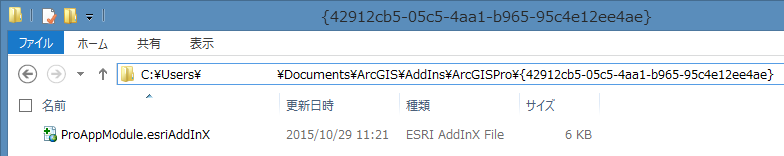

**ステップ 7**

ソリューション エクスプローラーのプロジェクトを右クリックし、[追加] → [新しい項目] をクリックします。

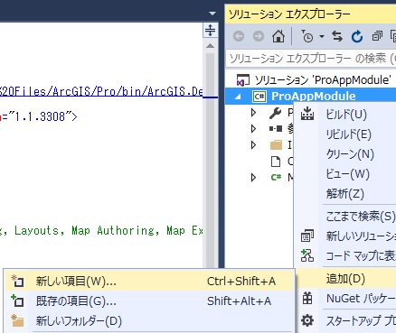

[新しい項目の追加] ダイアロが開きます。[Visual C#] → [ArcGIS] と展開し [ArcGIS Pro Add-ins] フォルダーを選択します。ArcGIS Pro SDK のアイテム テンプレートから [ArcGIS Pro ボタン] を選択します。ファイル名はそのまま Button1.cs として [追加] をクリックします。

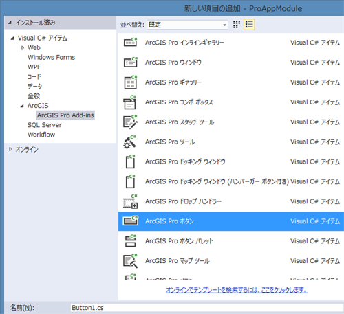

**ステップ 8**

プロジェクトに新しいファイル Button1.cs が追加されます。また Config.daml の <controls> タグ内には自動的に button コントロールが追加されます。

```xml
<controls>
  <!-- add your controls here -->
  <button id="ProAppModule_Button1" caption="Button 1" className="Button1" loadOnClick="true" ...
```

Button1.cs をダブルクリックして開き、以下のコードを OnClick メソッド内に追加します。

```csharp
internalclassButton1 : Button {

	protectedoverridevoid OnClick()
	{
		string uri = ArcGIS.Desktop.Core.Project.Current.URI;
		ArcGIS.Desktop.Framework.Dialogs.MessageBox.Show(string.Format("Project uri {0}", uri));
	}
}
```

**ステップ 9**

プロジェクトをビルドします。

**ステップ 10**

OnClick メソッドの最初の行にブレイク ポイントを設定して Visual Studio のデバッグを開始します。

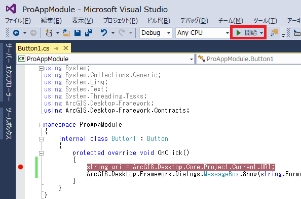

**ステップ 11**

ArcGIS Pro が起動します。プロジェクト テンプレートから任意のテンプレートを選択して新規にプロジェクトを作成するか、既存のプロジェクトを開きます。

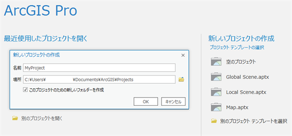

**ステップ 12**

[アドイン] タブをクリックし、[Button1] ボタンをクリックします。

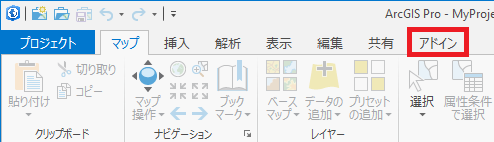

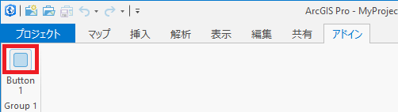

**ステップ 13**

Button 1　ボタンをクリックすると処理が Visual Studio のブレイク ポイントで停止します。 [F5] キーか [続行] ボタンをクリックし処理を継続します。ArcGIS Pro 上にメッセージ ボックスが表示され現在のプロジェクトのパスが表示されます。

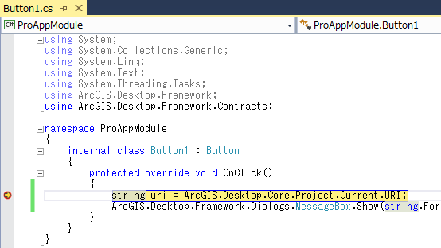
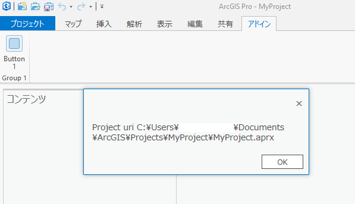

[OK] ボタンをクリックしてデバッグを終了します。

---

[メインページへ戻る](../README.md)
